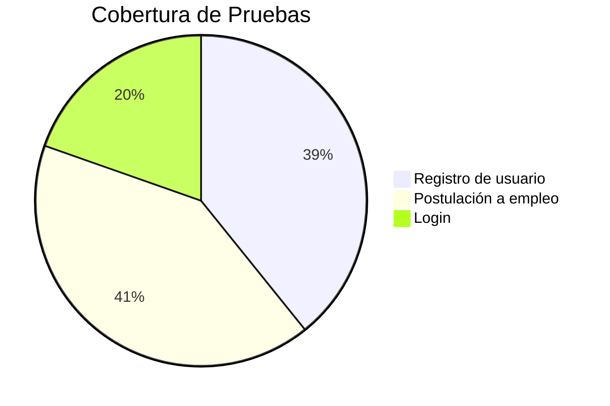

# Talento Lab - Plataforma de Reclutamiento IT


Plataforma web/mobile que conecta profesionales IT con oportunidades laborales mediante un sistema inteligente de matching.

## 📌 Características Principales
- **Registro intuitivo** con validación en tiempo real
- **Sistema de matching** automático entre candidatos y vacantes
- **Panel de control** para empresas y candidatos
- **Gestión documental** de CVs y portafolios
- **Notificaciones en tiempo real** de postulaciones

## 🛠 Tecnologías Utilizadas
| Frontend              | Backend               | Testing               |
|-----------------------|-----------------------|-----------------------|
| React 18              | Node.js 18            | Jest                  |
| Tailwind CSS          | Express.js            | Cypress               |
| React Router 6        | MongoDB 6             | Zephyr Scale          |
| Lucide Icons          | JWT Authentication    | Postman               |

## 🚀 Instalación
```bash
# Clonar repositorio
git clone https://github.com/tu-usuario/talento-lab.git

# Instalar dependencias
cd talento-lab
npm install

# Iniciar servidor de desarrollo
npm run dev
```

## 🔍 Criterios de Calidad


## ✅ Plan de Pruebas
- **Metodología:** Agile Testing
- **Herramientas:** 
  - Jira para gestión de incidencias
  - Zephyr Scale para ejecución de test cases
  - SonarQube para análisis estático

## 🤝 Contribución
1. Haz fork del proyecto
2. Crea tu branch (`git checkout -b feature/nueva-funcionalidad`)
3. Realiza tus cambios
4. Ejecuta pruebas (`npm test`)
5. Haz commit de los cambios (`git commit -m 'feat: nueva funcionalidad'`)
6. Push a la branch (`git push origin feature/nueva-funcionalidad`)
7. Abre un Pull Request

## 📄 Licencia
[MIT](https://choosealicense.com/licenses/mit/)

> **Nota:** Proyecto académico desarrollado como parte del programa de Talento Lab

